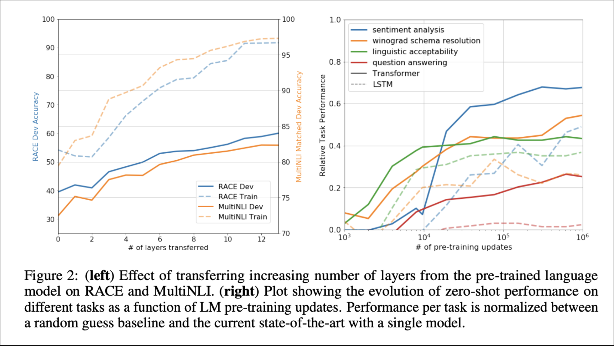

**GPT1 (Improving Language Understanding by Generative Pre-Training)**

https://cdn.openai.com/research-covers/language-unsupervised/language_understanding_paper.pdf?utm_source=substack&utm_medium=email

Note: LSTM refers to long-term short-term memory.

GPT-1

Semi-supervised approach for language understanding tasks using a combo of unsupervised pre-training and supervised fine-tuning.

“Our goal is to learn a universal representation that transfers with little adaptation to a wide range of tasks.” (Page 2)

Framework:

1. Unsupervised pre-training:

Employ standard language modeling objective for likelihood function based on unsupervised corpus of tokens.

Self-attention operation  over input context tokens + position-wise feedforward layers for output dist. over target tokens

2.Supervised fine-tuning

Inputs passed thru pre-trained model to acquire final transformer block’s activation, -> later fed into added linear output layer to eventually predict y

3.Input Transformations

Input modifications for entailment tasks, similarity tasks, and question answering + commonsense reasoning tasks

Experiments:

Unsupervised pre-training on BooksCorpus dataset

For supervised fine-tuning,

1.Natural Language Inference

Evaluations on image captions, transcribed speech, popular fiction, and gov. Reports, Wikipedia articles, science exams, or news articles.

2.QA and commonsense reasoning -> question answering which requires aspects of single and multi-sentence reasoning.

3.Semantic similarity detects whether two sentences are semantically equivalent or not.

4.Classification: Grammatical sentence or not?

Major goal of Machine Learning research at time was to use unsupervised (pre-)training to boost performance on discriminative tasks. Future developments in unsupervised learning for both natural lang. And other domains.

**GPT 2 (Language Models are Unsupervised Multitask Learners)**

https://cdn.openai.com/better-language-models/language_models_are_unsupervised_multitask_learners.pdf?utm_source=substack&utm_medium=email

Perform downstream tasks in zero-shot setting and perform wide range of tasks in a zero-shot setting.

